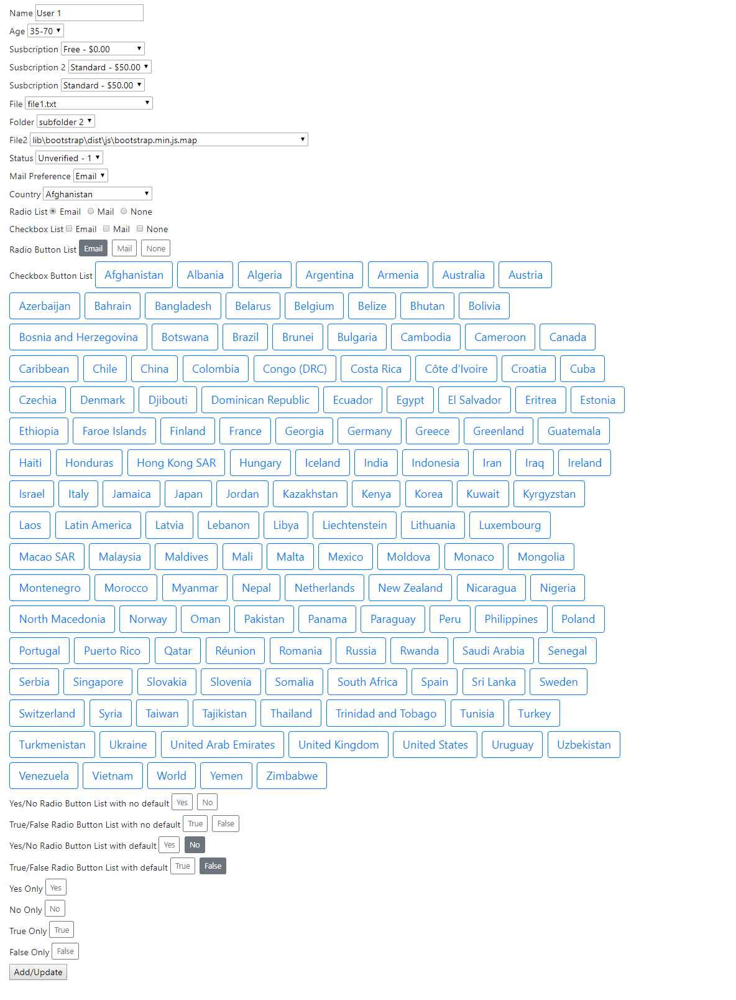

# ASP.NET Core MVC Select List Attributes

[](https://www.nuget.org/packages/AspNetCore.Mvc.SelectList/)  

ASP.NET Core library which gives the ability to specify select lists via Model Attributes at both Type and Property levels. The select lists can be used to populate dropdowns but also as an IEnumerable collection to loop through in views.

Features:
1. Uses expression syntax such as "{Id} - {Description} - {Cost}" for SelectListItem text/value rather than a single property. I recommend using nameof(Class.Property) for compile time safety.
2. Uses HtmlHelper.Display to render text/value rather than reflection used in [SelectList](https://github.com/aspnet/AspNetCore/blob/c565386a3ed135560bc2e9017aa54a950b4e35dd/src/Mvc/Mvc.ViewFeatures/src/Rendering/SelectList.cs) and [MultiSelectList](https://github.com/aspnet/AspNetCore/blob/c565386a3ed135560bc2e9017aa54a950b4e35dd/src/Mvc/Mvc.ViewFeatures/src/Rendering/MultiSelectList.cs). The advantage being you get model property formatting.
3. When used with services.AddSelectListAttributes() select lists (where selectListId = null) are automatically bound to SelectTagHelper and can be overriden by setting ViewBag.Property or ViewData["Property"] to IEnumerable\<SelectListItem\>. Usually [SelectTagHelper](https://github.com/aspnet/AspNetCore/blob/f5b6039add50ea84ddb151cd6daf5207119dc116/src/Mvc/Mvc.TagHelpers/src/SelectTagHelper.cs) doesn't allow passing IEnumerable\<SelectListItem\> in the ViewBag/ViewData.
4. Ability to define additional select lists by specifying selectListId.
5. Ability to extend by inheriting from SelectListAttribute. Have access to IServiceProvider on the SelectListContext.
6. Not limited to model properties. Can also be applied to types.
7. Tag helpers for bootstrap 4 radio and checkbox lists.
8. EF Core Value Converters for persisting lists as CSV or Json.

Advantages:
1. Keep select list logic with model, controllers slim and views for render only.
2. Could be exended to expose select lists via API in a generic fashion. e.g /api/customers/lookup/{selectListId} or /api/customers/age/lookup/{selectListId}

## Installation

### NuGet
```
PM> Install-Package AspNetCore.Mvc.SelectList
```

### .Net CLI
```
> dotnet add package AspNetCore.Mvc.SelectList
```

## Usage

```
services.AddSelectListAttributes();
```
#### Model Example



```
public enum MailPreference
{
	[Display(Name = "Email")]
	Email,
	[Display(Name = "Mail")]
	Mail,
	[Display(Name = "None")]
	None
}

public class Subscription
{
	public string Id { get; set; }

	public int Order { get; set; }

	public string Description { get; set; }

	[DisplayFormat(DataFormatString = "{0:C2}")]
	public decimal Cost { get; set; }
}

[SelectListDb(typeof(AppDbContext), typeof(Customer), OrderByProperty = nameof(Customer.Id))]
public class Customer
{
	[HiddenInput]
	public Guid Id { get; set; }

	[Required]
	[Display(Name = "Name")]
	public string Name { get; set; }

	[Display(Name = "Age")]
	[SelectListOptions("18-30","31-50","50+")]
	[SelectListOptions("35-70", "70-80", "80+", SelectListId = "List2")]
	public string Age { get; set; }

	[Display(Name = "Susbcription")]
	[SelectListDb(typeof(AppDbContext), typeof(Subscription), "{" + nameof(Subscription.Description) + "} - {" + nameof(Subscription.Cost) + "}", OrderByProperty = nameof(Subscription.Order), OrderByType = "asc" )]
	public string SubscriptionId { get; set; }

	[Display(Name = "Susbcription 2")]
	[SelectListDb(typeof(AppDbContext), typeof(Subscription), "SELECT * FROM Subscriptions WHERE Description = {0}", new object[] { "Standard" }, "{" + nameof(Subscription.Description) + "} - {" + nameof(Subscription.Cost) + "}")]
	public string SubscriptionId2 { get; set; }

	[Display(Name = "Susbcription")]
	[SelectListDb(typeof(AppDbContext), typeof(Subscription), "{" + nameof(Subscription.Description) + "} - {" + nameof(Subscription.Cost) + "}", OrderByProperty = nameof(Subscription.Order), OrderByType = "asc")]
	[SelectListDbWhereEquals(nameof(Subscription.Description), "Standard")]
	public string SubscriptionId3 { get; set; }

	[Display(Name = "File")]
	[SelectListFile("files")]
	public string File { get; set; }

	[Display(Name = "Folder")]
	[SelectListFolder("files")]
	public string Folder { get; set; }

	[Display(Name = "File2")]
	[SelectListFile("wwwroot")]
	public string File2 { get; set; }

	[Display(Name = "Status")]
	[SelectListDb(typeof(AppDbContext), typeof(Status), "{" + nameof(Status.Description) + "} - {" + nameof(Status.Id) + "}", OrderByType = "asc")]
	public int StatusId { get; set; }

	[Display(Name = "Mail Preference")]
	[SelectListEnum]
	public MailPreference MailPreference { get; set; }

	[Display(Name = "Country")]
	[SelectListCountry]
	public string CountryCode { get; set; }

	[CsvDb]
	[LimitOptionsMinMax(1,2)]
	[Display(Name = "Checkbox List")]
	[SelectListEnum]
	public List<MailPreference> CheckboxValues { get; set; } = new List<MailPreference>();

	[CsvDb]
	[LimitOptionsMin(1)]
	[Display(Name = "Checkbox Button List")]
	[SelectListCountry]
	public List<string> CheckboxButtonValues { get; set; } = new List<string>();

	[Required]
	[Display(Name = "Radio List")]
	[SelectListEnum]
	public MailPreference RadioValue { get; set; }

	[Required]
	[Display(Name = "Radio Button List")]
	[SelectListEnum]
	public MailPreference RadioButtonValue { get; set; }

	[Display(Name = "Yes/No Radio Button List with no default")]
	[SelectListYesNo]
	public bool? YesNo { get; set; }

	[Display(Name = "True/False Radio Button List with no default")]
	[SelectListTrueFalse]
	public bool? TrueFalse { get; set; }

	[Display(Name = "Yes/No Radio Button List with default")]
	[SelectListYesNo]
	public bool YesNoDefault { get; set; }

	[Display(Name = "True/False Radio Button List with default")]
	[SelectListTrueFalse]
	public bool TrueFalseDefault { get; set; }

	[Display(Name = "Yes Only")]
	[SelectListYes]
	public bool Yes { get; set; }

	[Display(Name = "No Only")]
	[SelectListNo]
	public bool No { get; set; }

	[Display(Name = "True Only")]
	[SelectListTrue]
	public bool True { get; set; }

	[Display(Name = "False Only")]
	[SelectListFalse]
	public bool False { get; set; }
}
```
#### View Example
```
@model Customer

<form asp-controller="Customer" asp-action="Update" method="post">
	<input asp-for="Id" />
	<label asp-for="Name"></label>
	<input asp-for="Name">
	<span asp-validation-for="Name" class="text-danger"></span>
	<br />
	<label asp-for="Age"></label>
	<select asp-for="Age" asp-items="@(Html.SelectListFor(model => model.Age, "List2"))"></select>
	<span asp-validation-for="Age" class="text-danger"></span>
	<br />
	<label asp-for="SubscriptionId"></label>
	<select asp-for="SubscriptionId"></select>
	<span asp-validation-for="SubscriptionId" class="text-danger"></span>
	<br />
	<label asp-for="SubscriptionId2"></label>
	<select asp-for="SubscriptionId2"></select>
	<span asp-validation-for="SubscriptionId2" class="text-danger"></span>
	<br />
	<label asp-for="SubscriptionId3"></label>
	<select asp-for="SubscriptionId3"></select>
	<span asp-validation-for="SubscriptionId3" class="text-danger"></span>
	<br />
	<label asp-for="File"></label>
	<select asp-for="File"></select>
	<span asp-validation-for="File" class="text-danger"></span>
	<br />
	<label asp-for="Folder"></label>
	<select asp-for="Folder"></select>
	<span asp-validation-for="Folder" class="text-danger"></span>
	<br />
	<label asp-for="File2"></label>
	<select asp-for="File2"></select>
	<span asp-validation-for="File2" class="text-danger"></span>
	<br />
	<label asp-for="StatusId"></label>
	<select asp-for="StatusId"></select>
	<span asp-validation-for="StatusId" class="text-danger"></span>
	<br />
	<label asp-for="MailPreference"></label>
	<select asp-for="MailPreference"></select>
	<span asp-validation-for="MailPreference" class="text-danger"></span>
	<br />
	<label asp-for="CountryCode"></label>
	<select asp-for="CountryCode"></select>
	<span asp-validation-for="CountryCode" class="text-danger"></span>
	<br />
	<label asp-for="RadioValue"></label>
	<radio-checkbox-list asp-for="RadioValue"></radio-checkbox-list>
	<span asp-validation-for="RadioValue" class="text-danger"></span>
	<br />
	<label asp-for="CheckboxValues"></label>
	<radio-checkbox-list asp-for="CheckboxValues"></radio-checkbox-list>
	<span asp-validation-for="CheckboxValues" class="text-danger"></span>
	<br />
	<label asp-for="RadioButtonValue"></label>
	<radio-checkbox-button-list asp-for="RadioButtonValue"></radio-checkbox-button-list>
	<span asp-validation-for="RadioButtonValue" class="text-danger"></span>
	<br />
	<label asp-for="CheckboxButtonValues"></label>
	<radio-checkbox-button-list asp-for="CheckboxButtonValues" class="btn btn-outline-primary mr-2 mb-2 btn-lg"></radio-checkbox-button-list>
	<span asp-validation-for="CheckboxButtonValues" class="text-danger"></span>
	<br />
	<label asp-for="YesNo"></label>
	<radio-checkbox-button-list asp-for="YesNo"></radio-checkbox-button-list>
	<span asp-validation-for="YesNo" class="text-danger"></span>
	<br />
	<label asp-for="TrueFalse"></label>
	<radio-checkbox-button-list asp-for="TrueFalse"></radio-checkbox-button-list>
	<span asp-validation-for="TrueFalse" class="text-danger"></span>
	<br />
	<label asp-for="YesNoDefault"></label>
	<radio-checkbox-button-list asp-for="YesNoDefault"></radio-checkbox-button-list>
	<span asp-validation-for="YesNoDefault" class="text-danger"></span>
	<br />
	<label asp-for="TrueFalseDefault"></label>
	<radio-checkbox-button-list asp-for="TrueFalseDefault"></radio-checkbox-button-list>
	<span asp-validation-for="TrueFalseDefault" class="text-danger"></span>
	<br />
	<label asp-for="Yes"></label>
	<radio-checkbox-button-list asp-for="Yes" checkbox="true"></radio-checkbox-button-list>
	<span asp-validation-for="Yes" class="text-danger"></span>
	<br />
	<label asp-for="No"></label>
	<radio-checkbox-button-list asp-for="No" checkbox="true"></radio-checkbox-button-list>
	<span asp-validation-for="No" class="text-danger"></span>
	<br />
	<label asp-for="True"></label>
	<radio-checkbox-button-list asp-for="True" checkbox="true"></radio-checkbox-button-list>
	<span asp-validation-for="True" class="text-danger"></span>
	<br />
	<label asp-for="False"></label>
	<radio-checkbox-button-list asp-for="False" checkbox="true"></radio-checkbox-button-list>
	<span asp-validation-for="False" class="text-danger"></span>
	<br />
	<button type="submit">Add/Update</button>
</form>

@section Scripts {
    <partial name="_ValidationScriptsPartial" />
}
```

```
@addTagHelper *, AspNetCore.Mvc.SelectList
```

#### Get List
```
@foreach (var item in await Html.SelectListForModelTypeAsync<Customer>())
{
	@item.Html.DisplayFor(c => c.Name);
	<br />
}
```
#### Filter by Id
```
{
	var item = await Html.SelectListForModelTypeAsync<Customer>(new object[]{"ecf1f87a-ce11-471d-abae-735d23c91256"}).FirstOrDefault();
	@item.Html.DisplayFor(c => c.Name);
}
```
#### Override Attribute Select List
```
[HttpGet]
public IActionResult Edit()
{
	ViewBag.File = new List<SelectListItem>() { };

	return View("Edit", _db.Customers.Find(_customerId));
}
```

#### Custom Select List Attribute

```
public class SelectListCustomAttribute : SelectListAttribute
{
	public SelectListCustomAttribute()
	{

	}

	protected override Task<IEnumerable<SelectListItem>> GetSelectListItemsAsync(SelectListContext context)
	{
		var db = context.HttpContext.RequestServices.GetRequiredService<AppContext>();
		return new List<SelectListItem>();
	}     
}
```

## Select List Attributes

| Attribute                        | Description                                                                        |
|:---------------------------------|:-----------------------------------------------------------------------------------|
| SelectListAttribute              | Base class for extension                                                           |
| SelectListOptionsAttribute       | Specify Options                                                                    |
| SelectListDbAttribute            | Specify DbContext and ModelType                                                    |
| SelectListDbWhereEqualsAttribute | Specify DbContext Where Property Equals Clause                                     |
| SelectListEnumAttribute          | Automatically calls Html.GetEnumSelectList()                                       |
| SelectListFileAttribute          | Specify physical, Content Root virtual or Web Root virtual path such as "~/files/" |
| SelectListFolderAttribute        | Specify physical, Content Root virtual or Web Root virtual path such as "~/files/" |
| SelectListCountryAttribute       | Lists Countries                                                                    |
| SelectListTrueFalseAttribute     | True and False options binding to boolean or boolean?                              |
| SelectListTrueAttribute          | True option binding to boolean or boolean?                                         |
| SelectListFalseAttribute         | False option binding to boolean or boolean?                                        |
| SelectListYesNoAttribute         | Yes and No options binding to boolean or boolean?                                  |
| SelectListYesttribute            | Yes option binding to boolean or boolean?                                          |
| SelectListNoAttribute            | No options binding to boolean or boolean?                                          |


## Tag Helpers
| TagHelper                  | Description                                                                                              |
|:---------------------------|:---------------------------------------------------------------------------------------------------------|
| radio-checkbox-list        | Outputs radio or checkbox list based on model property type.                                             |
| radio-checkbox-button-list | Outputs radio or checkbox list buttons based on model property type. class attribute styles the buttons. |


## Db Converter Attributes
```
public class AppDbContext : DbContext
{
	public AppDbContext(DbContextOptions<AppDbContext> options)
		: base(options)
	{
		
	}

	protected override void OnModelCreating(ModelBuilder modelBuilder)
	{
		modelBuilder.AddCsvValues();
		modelBuilder.AddJsonValues();
	}
}
```

| Attribute | Description                                 |
|:----------|:--------------------------------------------|
| CsvDb     | Saves Array, List, Collections to Db as Csv |
| JsonDb    | Saves Object to Db as Json                  |


## Authors

* **Dave Ikin** - [davidikin45](https://github.com/davidikin45)


## License

This project is licensed under the MIT License